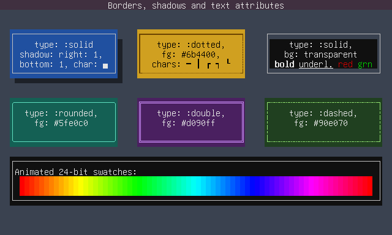
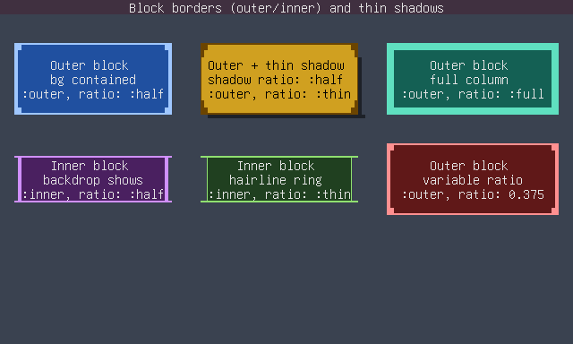
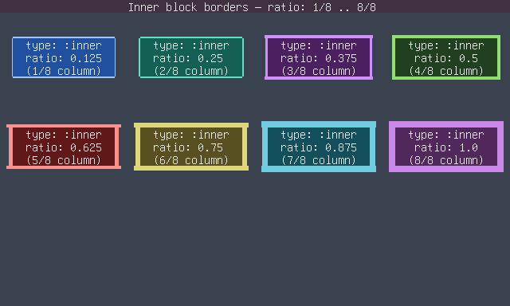
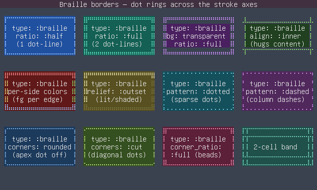
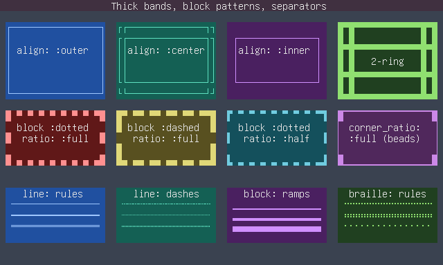
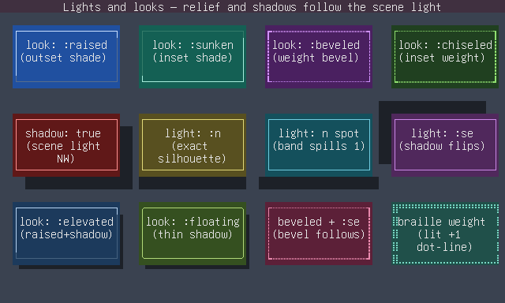
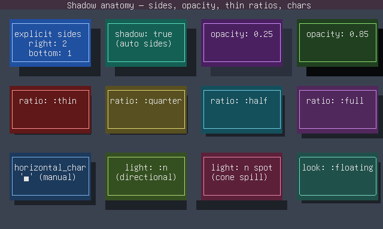

# Borders, shadows and light in Crysterm

Crysterm models a widget's border as orthogonal
axes — what the ink is made of, its dash pattern, where it sits, how thick it
is, how its corners join — plus a scene **light** that drives 3D relief and
drop shadows. Any combination renders: a point with no exact glyphs *rounds
down* to the most similar achievable rendition, never an error.



## The axes

| Axis | Values | Meaning |
| --- | --- | --- |
| `type` | media: `line` `block` `braille` `fill`; presets: `solid` `dashed` `dotted` `double` `rounded` `outer` `inner` | The one "what kind of border" knob. A bare medium names the ink (box-drawing glyphs, edge-anchored block ramps, braille dots, whole-cell fill); a richer preset fans several axes out at once (`:rounded` = line + arc corners, `:outer` = block + outer alignment, ...). |
| `pattern` | `solid` `dashed` `dotted` `double` | The dash pattern along the runs (Qt `PenStyle`). |
| `align` | `center` `outer` `inner` | Stroke alignment: a centered rule, ink flush with the widget's rim (ground = widget bg), or flush with the content (ground = transparent). At band widths ≥ 2 it also picks which ring of the band carries the rule. |
| `ratio` | `0.0..1.0`, `:thin` `:quarter` `:half` `:full` | Sub-cell thickness as a fraction of the cell width, aspect-compensated per axis. Block quantizes to eighths, braille to dot-lines; a line-type border above `1/2` goes heavy (`━ ┃`). |
| `corners` | per-corner `square` `rounded` `cut` | The join treatment (Qt `joinStyle` / CSS `border-radius`); radii are stored per corner for future multi-cell arcs. |
| `corner_ratio` | like `ratio`, unset = follow runs | The corners' *own* thickness — decorative corner beads (`▛` mounts on a hairline ring, `┏` joins on light runs, `⣿` blocks on a one-dot braille ring). |

```crystal
Border.new type: :rounded                                    # presets still work
Border.new type: :braille, align: :inner, pattern: :dotted  # axes compose
Border.new type: :outer, ratio: :thin, corner_ratio: :half   # corner beads
```

`type`'s vocabulary is one namespace: the bare media (`:line` `:block`
`:braille` `:fill`) and the richer presets (`:solid` `:dashed` `:dotted`
`:double` `:rounded` `:outer` `:inner` `:bg`) — setting one fans the axes
out, reading `type` back gives the nearest preset (`:block` reads back as
`:outer`, `:line` as `:solid`).

## The types

* **Line** — the five box-drawing families, now composable: dashed+rounded,
  cut corners (`╱ ╲`), per-corner tab shapes, heavy weight via `ratio`.
  Highlights in [`styling.cr`](tests/misc/styling.cr).
* **Block** — edge-anchored block ink (`▀ ▌ …`) at any eighth. The full
  thickness ladders: [`styling2.cr`](tests/misc/styling2.cr) (outer,
  ink flush with the rim) and [`styling3.cr`](tests/misc/styling3.cr)
  (inner, a transparent-ground ring hugging the content).

  
  
* **Braille** — dot-pattern rings (U+2800..) whose corners are the *union*
  of the adjoining runs' dots, flush by construction; sparse dotted/dashed
  patterns, apex-dot rounded corners, diagonal-dot cuts, inner anchoring.
  The whole axis tour: [`styling4.cr`](tests/misc/styling4.cr).

  
* **Fill** — whole-cell fill via `fill_char` + colors (the classic `bg`
  border).

## Thick bands, block patterns and separators

At side widths ≥ 2 the `align` axis picks the ruled ring — `outer` the rim,
`inner` the content-hugging ring, `center` the classic repeat-through-the-
band. A block `Double` pattern rules rim *and* content rings (the two-ring
frame a single cell can't express); block dashed/dotted patterns gap whole
run cells, phase-locked to the corners. Separators are the same vocabulary:
`Widget::Line`/`HLine`/`VLine` take `type:`/`pattern:`/`ratio:` and derive
their rule — including centered braille dot-rows, which no box-drawing glyph
can do. All of it: [`styling6.cr`](tests/misc/styling6.cr).



## Light, relief and looks

Relief shading and shadow placement are projections of one fact — where the
light is. `Window#light` holds the scene default (NW directional, the
classic top-left assumption made explicit); `Style#light` overrides per
widget. A `Light` is an 8-way direction plus a kind: `Directional`
(parallel rays — a cast shadow is the widget's exact silhouette) or `Spot`
(a point source; auto shadows spill one cell past their free ends).

`Border#relief` (`inset outset groove ridge`) shades the lit/shaded sides;
`relief_style: :weight` renders the same classification in glyph weight
instead (`┏ ┉ ┑` — the hand-made bevel of old, automatic). `Style#look`
bundles the common combinations: `flat raised sunken beveled chiseled
floating elevated`. All shown in [`styling5.cr`](tests/misc/styling5.cr).



## Shadows

A `Shadow` has per-side extents, `opacity`, an optional thin-shadow `ratio`
(the same sub-cell unit as borders — bands hug the widget at that
thickness), per-position char overrides, and auto placement: constructed
without explicit sides (`shadow: true`, the `Floating` look) it falls on
the sides facing away from the light. The anatomy — explicit vs auto,
opacity, the thin ladder, chars, directional vs spot:
[`styling7.cr`](tests/misc/styling7.cr).



## CSS

```css
Box  { border: dotted braille inner #9fc7ff; }   /* axis tokens compose   */
Tab  { border: solid; border-radius: 8px 8px 0 0; }  /* per-corner        */
Card { look: elevated; light: nw; }
Thin { border: outer; border-ratio: thin; border-corner-ratio: half; }
```

| Property | Notes |
| --- | --- |
| `border`, `border-style` | Style tokens compose per axis (`dotted braille inner`); a single keyword keeps its exact legacy preset meaning. |
| `border-radius` (+ `border-<corner>-radius`) | Per-corner rounding, 1-4 values in tl/tr/br/bl order; works with every type. |
| `border-ratio`, `border-corner-ratio` | The thickness knobs (number, `%`, or `thin/quarter/half/full`). |
| `border-align` | `outer` \| `center` \| `inner`. |
| `light` | `<direction> [spot\|directional]`, e.g. `light: n spot`; on the root = the scene, on a widget = override. |
| `look` | `raised` \| `sunken` \| `beveled` \| `chiseled` \| `floating` \| `elevated` \| `flat`. |
| `relief-style` | `shade` \| `weight` \| `both`. |
| `box-shadow`, `shadow-char-*` | The shadow's CSS side. |

## Glyph tiers

Everything degrades honestly with the terminal's repertoire: the `Extended`
tier (kitty, WezTerm, Ghostty, iTerm2, …) renders exact eighths, sextant
corner pieces and braille; the plain `Unicode` tier snaps block steps to
1/8-4/8-8/8 and renders braille borders as the dotted/dashed line families;
`Ascii` collapses to `+ - |`. Pin with `window.glyph_tier =` or let
detection choose.
