[](https://github.com/crystallabs/crysterm/blob/master/LICENSE)

Crysterm is a console/terminal toolkit for Crystal, inspired by 
[Blessed](https://github.com/chjj/blessed), [Blessed-contrib](https://github.com/yaronn/blessed-contrib), and
[Qt](https://doc.qt.io/).

Advanced features:


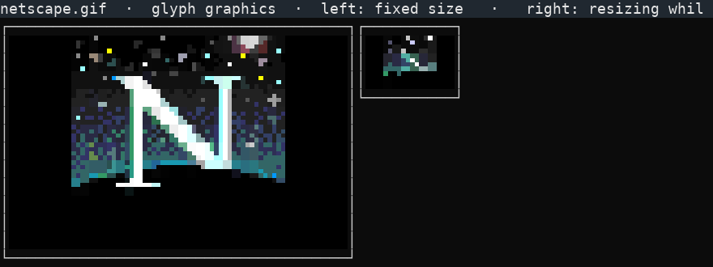


Image-rendering backends:

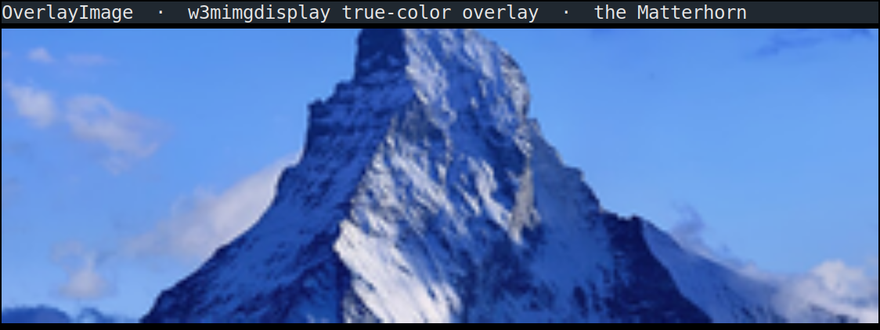

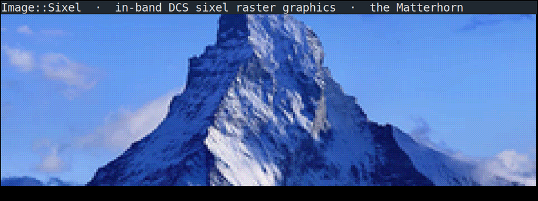

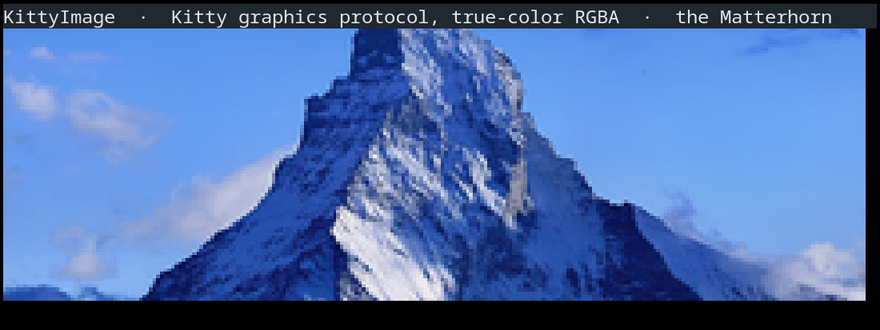

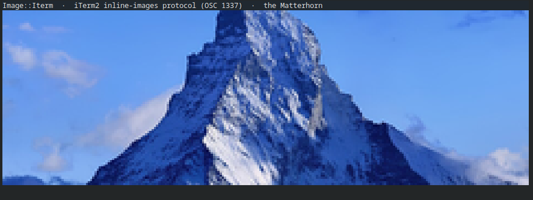

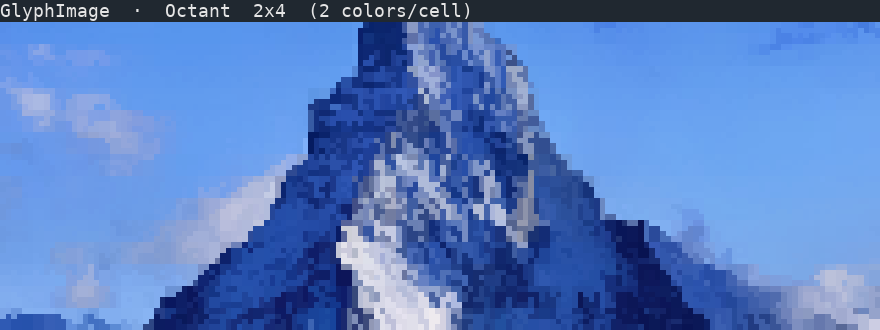


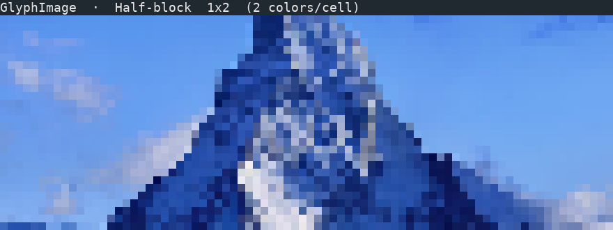

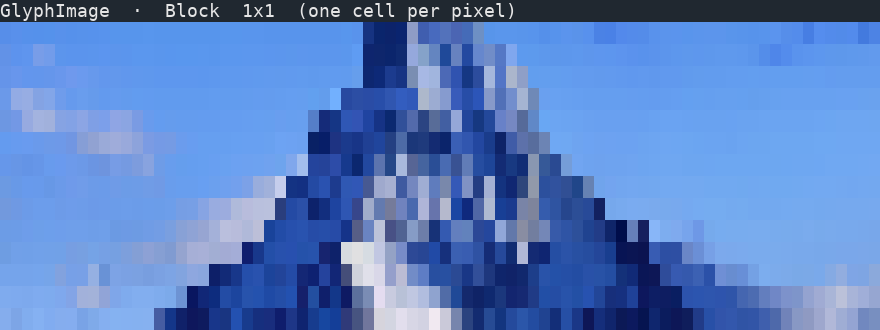

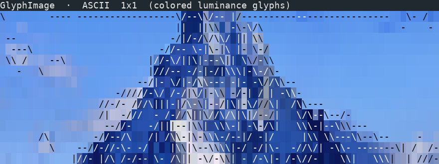

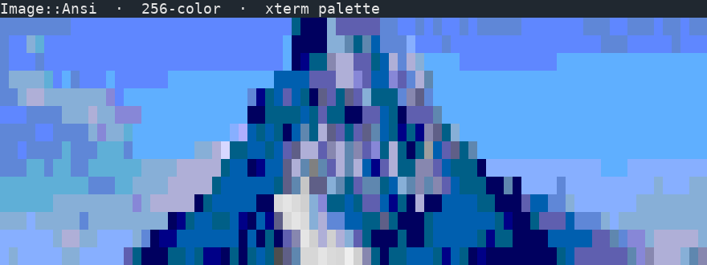

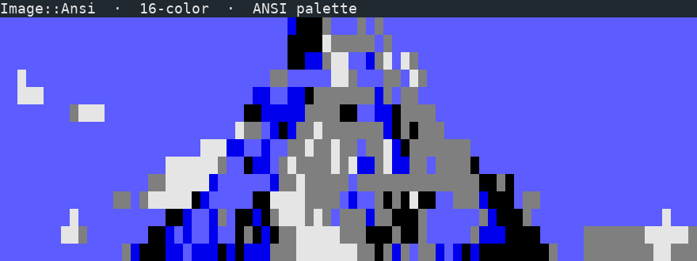

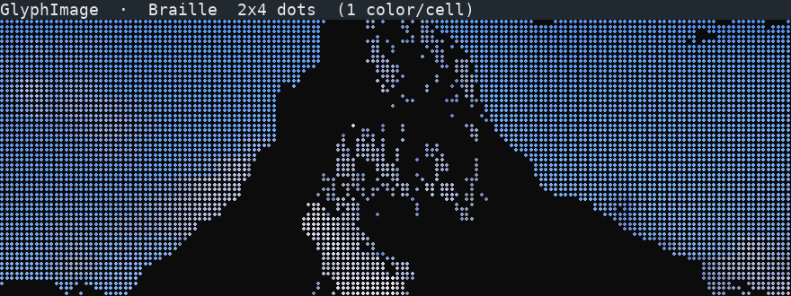

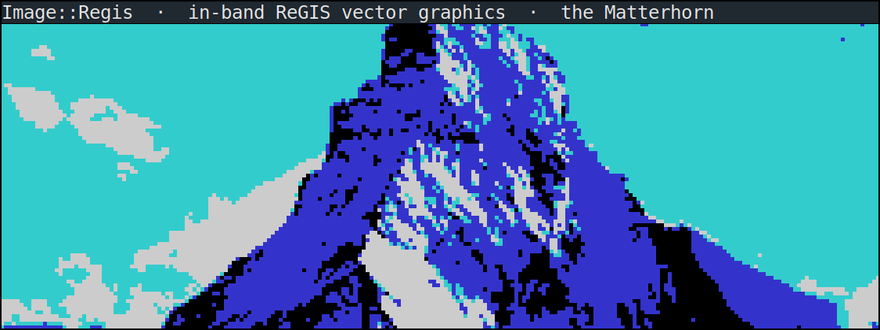

Image::Tek (Tektronix 4014):

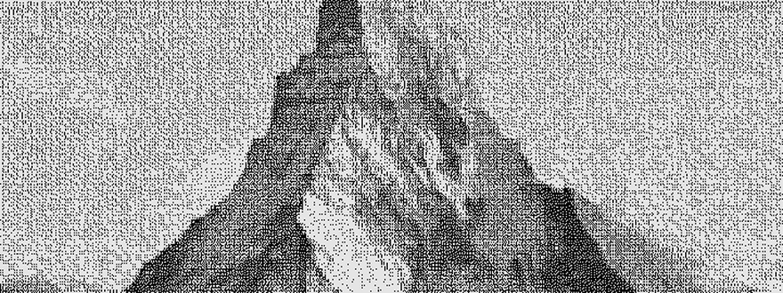

## Tech intro

Crysterm is supported by the event model in 
[event_handler](https://github.com/crystallabs/event_handler), color routines in
[term_colors](https://github.com/crystallabs/term_colors), terminal handling in
[tput.cr](https://github.com/crystallabs/tput.cr), GPM mouse in
[gpm.cr](https://github.com/crystallabs/gpm.cr), a terminfo library in
[unibilium.cr](https://github.com/crystallabs/unibilium.cr), and an animated PNG/GIF parser
in [pnggif](https://github.com/crystallabs/pnggif).

[tput.cr](https://github.com/crystallabs/tput.cr) implements all the terminal routines, and
does not use ncurses. For terminfo bindings it uses [unibilium](https://github.com/neovim/unibilium/),
but it also supports a built-in, standard mode which does not use terminfo at all.
(A lot of modern software just hardcodes the sequences.)
The other important module at Crysterm's core is [event_handler](https://github.com/crystallabs/event_handler).
through which all app events and input are routed.

In-depth introductory doc is in [USAGE.md](https://github.com/crystallabs/crysterm/blob/master/USAGE.md).

## Examples

```
git clone https://github.com/crystallabs/crysterm
cd crysterm
shards

crystal examples/hello.cr
crystal examples/hello2.cr
crystal examples/tech-demo.cr
```

(And other examples from directories `examples/` and `tests/`.)

## Testing

Run `crystal spec` as usual.

## Documentation

Run `crystal docs` as usual.

## Thanks

* All the fine folks in the [Crystal community](https://crystal-lang.org/community/).
