Crysterm is a console/terminal toolkit for Crystal, inspired by 
[Blessed](https://github.com/chjj/blessed), [Blessed-contrib](https://github.com/yaronn/blessed-contrib), and
[Qt](https://doc.qt.io/).

Advanced features:


Image-rendering backends:

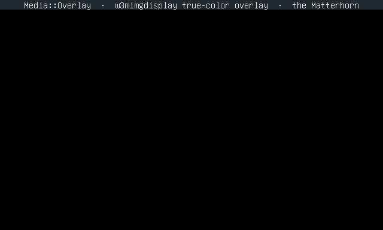

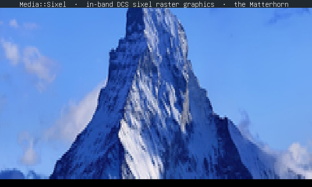

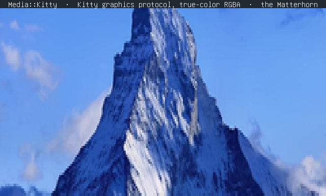

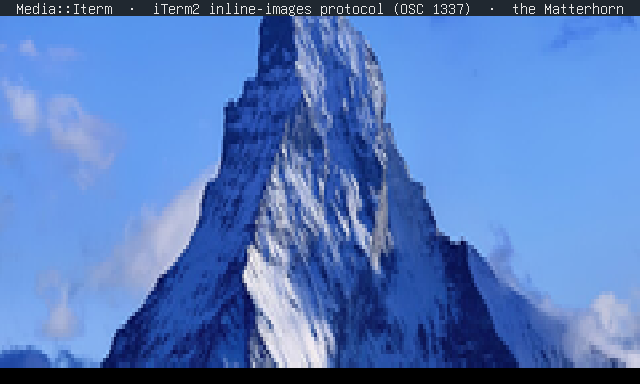

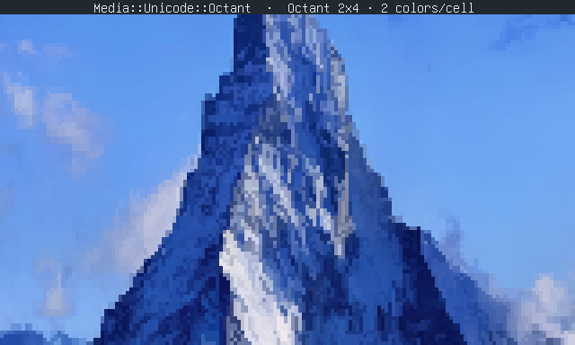

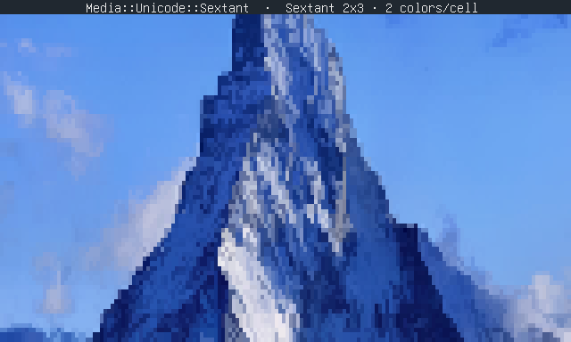

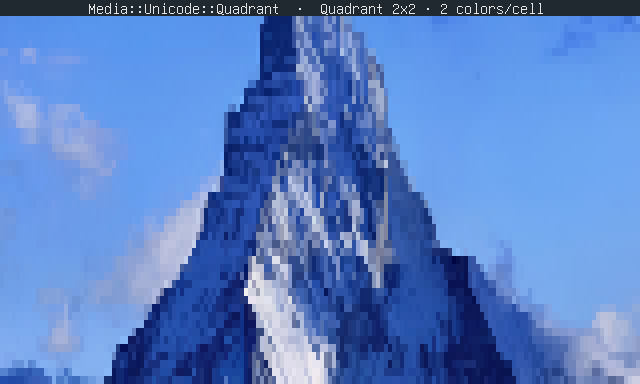

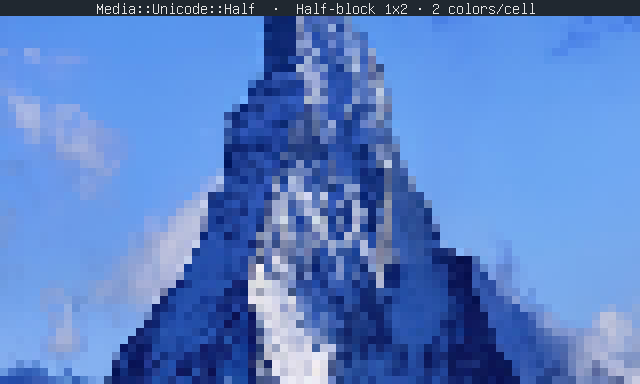


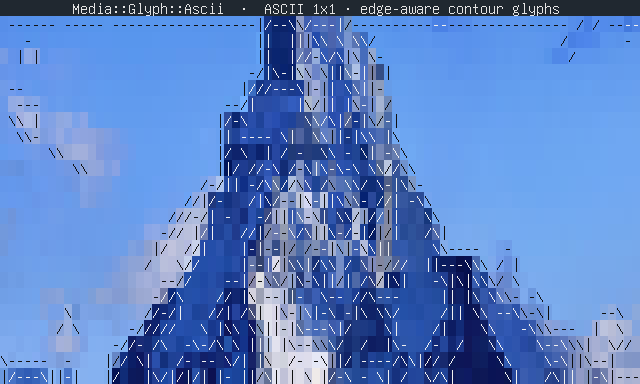

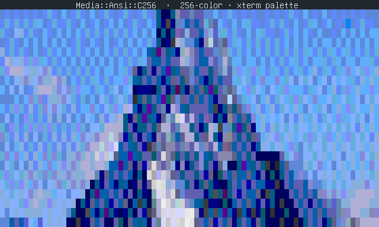

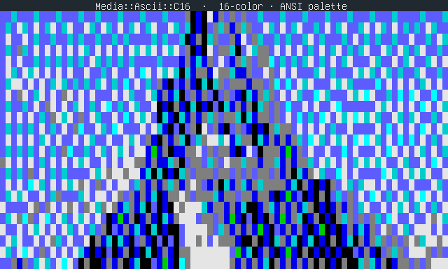

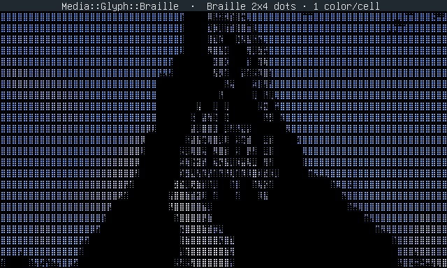

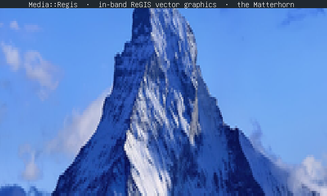

Image::Tek (Tektronix 4014):


## Tech intro

Crysterm is supported by the event model in 
[event_handler](https://github.com/crystallabs/event_handler), color routines in
[term_colors](https://github.com/crystallabs/term_colors), terminal handling in
[tput.cr](https://github.com/crystallabs/tput.cr), GPM mouse in
[gpm.cr](https://github.com/crystallabs/gpm.cr), a terminfo library in
[unibilium.cr](https://github.com/crystallabs/unibilium.cr), and an animated PNG/GIF parser
in [pnggif](https://github.com/crystallabs/pnggif).

[tput.cr](https://github.com/crystallabs/tput.cr) implements all the terminal routines, and
does not use ncurses. For terminfo bindings it uses [unibilium](https://github.com/neovim/unibilium/),
but it also supports a built-in, standard mode which does not use terminfo at all.
(A lot of modern software just hardcodes the sequences.)
The other important module at Crysterm's core is [event_handler](https://github.com/crystallabs/event_handler).
through which all app events and input are routed.

In-depth introductory doc is in [USAGE.md](https://github.com/crystallabs/crysterm/blob/master/USAGE.md).

## Hello world

```cr
require "crysterm"

alias C = Crysterm

# A `Window` is the surface your widgets live on.
window = C::Window.new title: "hello"

C::Widget::Box.new \
  parent: window,
  top: "center", left: "center", width: 20, height: 5,
  content: "{center}'Hello {bold}world{/bold}!'\nPress q to quit.{/center}",
  style: C::Style.new(fg: "yellow", bg: "blue", border: true)

# `q` / Ctrl-Q quit by default. Run the main loop:
window.exec
```

## Examples

```
git clone https://github.com/crystallabs/crysterm
cd crysterm
shards

crystal examples/hello.cr          # the program above
crystal examples/hello2.cr         # the Qt shape: MainWindow + a layout
crystal tests/misc/qt_widgets.cr   # tour of the Qt-inspired widget set
crystal tests/misc/widgets.cr      # tour of the general widget set
```

Larger, complete applications:

```
crystal examples/mutt/mutt.cr               # a Mutt-style mail client
crystal examples/pine/pine.cr               # a Pine/Alpine-style mail client
crystal examples/terminal/tid/tid.cr        # a terminal multiplexer
crystal examples/games/minesweeper/minesweeper.cr
crystal examples/games/pong/pong.cr
crystal examples/games/commando/commando.cr
crystal examples/games/wumpus/wumpus.cr
```

(And many more under `examples/` and `tests/`.)

## Testing

Run `crystal spec` as usual.

## Documentation

Run `crystal docs` as usual.

## Thanks

* All the fine folks in the [Crystal community](https://crystal-lang.org/community/).
