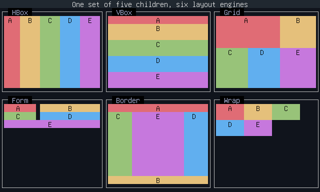
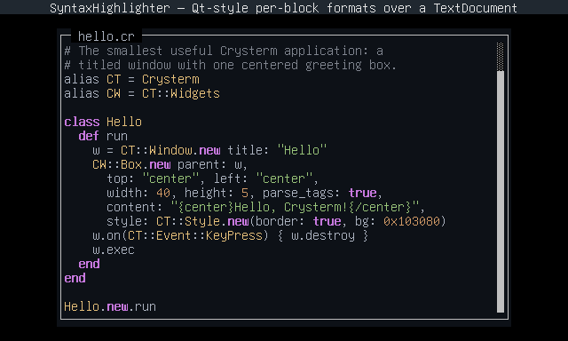
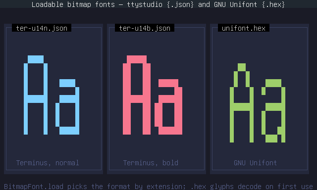
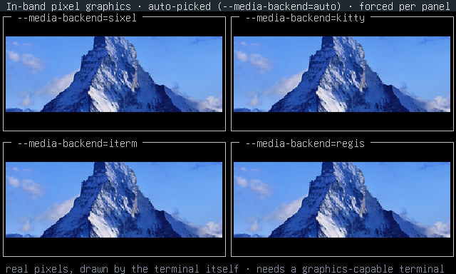
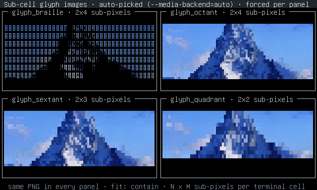
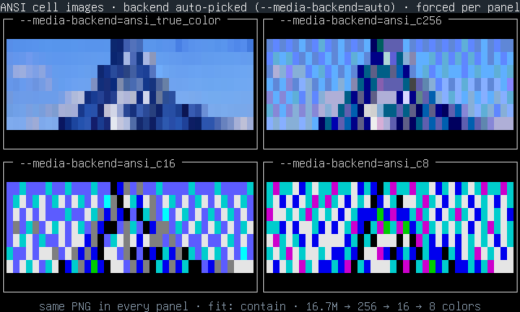
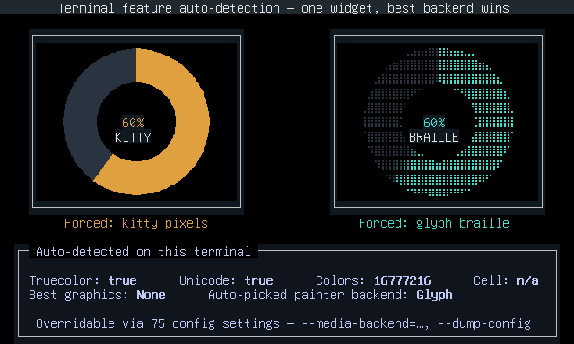

Crysterm is a console/terminal toolkit (TUI), inspired by
[Qt](https://doc.qt.io/), [Blessed](https://github.com/chjj/blessed),
and [Blessed-contrib](https://github.com/yaronn/blessed-contrib).

It is implemented in [Crystal](https://crystal-lang.org/). Apps using
Crysterm can be written using AI.

Main features:

## 90+ Qt-like widgets

More than 90 concrete widgets with Qt-modeled APIs and behavior.


*Source: [tests/misc/qt_widgets.cr](tests/misc/qt_widgets.cr). See also
[tests/misc/widgets.cr](tests/misc/widgets.cr), per-widget demos under
[tests/widget/](tests/widget/), and the directory with widgets in
[src/wiget/](src/wiget/).*

## Layouts

As in Qt, widgets are best positioned by layout engines rather than by
absolute coordinates. There are 11 layouts supported.



*Source: [tests/misc/layouts.cr](tests/misc/layouts.cr). See also
[src/layout/](src/layout/).*

## CSS and QSS styling

A complete CSS engine is used for styling -- paddings, margins, borders
(including per-side and radius), colors, shadows, opacity, transitions, and
pixel measures (when possible) translated to cells via the terminal's
real cell geometry.

It also reads Qt QSS dialect directly — unmodified desktop Qt themes
can be used to style apps.

Six independent windows below run the same scene, each loaded
with a different theme from [data/css/](data/css/)
(`--colors-stylesheet data/css/<name>.qss` on any Crysterm program, or
`window.load_stylesheet`).


*Source: [tests/misc/themes.cr](tests/misc/themes.cr)*


*Source: [tests/misc/styling.cr](tests/misc/styling.cr)*

## Rich text — Markdown with GFM

`TextDocument` (a QTextDocument work-alike) supports **Markdown
(CommonMark + GFM)**, **HTML** and Crysterm's native tags, and
`TextEdit`/`TextBrowser` render it: headings, bold/italic/strikethrough,
inline code and links, fenced code blocks, blockquotes, GFM tables laid out
as real box-drawing tables, GFM task lists, and GFM alert admonitions —
themable via `TextTheme`, editable with full undo, navigable links.

Below is an example of a Claude-style session that is streaming a reply in
Markdown (note: this is not Claude, it is Crysterm's Claude-like example):


*Source: [examples/claude/claude.cr](examples/claude/claude.cr)*

## Syntax highlighting

`SyntaxHighlighter` mirrors Qt's `QSyntaxHighlighter`. Syntax formats overlay
the text without touching content, undo or export; multi-line constructs carry
state between blocks, and multiple highlighters can stack on one document.



*Source: [tests/misc/syntax.cr](tests/misc/syntax.cr)*

## Full Unicode

Unicode-native end to end: grapheme clusters (ZWJ emoji, combining marks),
wide CJK cells, ambiguous-width resolution probed from the live terminal,
East Asian width, and glyph chrome that auto-upgrades on modern-font
terminals.


*Source: [examples/text/editor/editor.cr](examples/text/editor/editor.cr)*

## Native TrueColor

Colors are natively stored as full 24-bit RGB and reduced to the terminal's real
capability only at output time (16.7M → 256 → 16 → 8 colors, automatically).
Alpha compositing blends colors per channel in RGB space; translucent
widgets, soft shadows, and smooth gradients are supported.


*Source: [tests/misc/truecolor.cr](tests/misc/truecolor.cr)*

## Hardware and artificial cursors

Cursor shape (`block` / `underline` / `bar`), blink, and color are settable
per window *and* per widget — each focused widget can present its own cursor.

When the terminal can't style its hardware cursor (or a custom glyph/style is
requested), Crysterm transparently composites an *artificial* cursor into the
cell buffer instead, re-deciding hardware-vs-artificial every frame:


*Source: [tests/misc/cursors.cr](tests/misc/cursors.cr)*

## Border docking with color blending

Adjacent and overlapping borders can dock into shared junction glyphs/chars
(`├ ┬ ┼ …`). When the touching borders differ in color, the difference can
be ignored or blended (for the smoothest seam), or the docking can be skipped.


*Source: [tests/misc/docking.cr](tests/misc/docking.cr)*

## `{}` tags in strings

Any widget content can carry inline tags (when `parse_tags: true`), for in-band
colors (`{red-fg}`, `{#57c7ff-bg}`), attributes (`{bold}`, `{underline}`,
`{inverse}`, `{blink}`), and alignment
(`{center}`, `{right}`, and `{|}` for left/right split).


*Source: [tests/misc/tags.cr](tests/misc/tags.cr)*

## Loadable fonts

`BitmapFont` loads GNU Unifont `.hex` and ttystudio `.json` fonts —
`BigText` renders text with them in the terminal, and the capture pipeline
rasterizes screenshots through them. Terminus and Unifont faces ship in
[data/font/](data/font/).



*Source: [tests/misc/fonts.cr](tests/misc/fonts.cr)*

## Rich media — images, animated images, and video

One `Media` widget, twenty-one backends, selected automatically per terminal
and per content (`--media-backend=auto`) or forced by config/CLI/env/code:

* **In-band pixels** — Kitty graphics, iTerm2 inline images, Sixel, ReGIS
* **Sub-cell glyphs** — octant (2×4), braille (2×4), sextant (2×3),
  quadrant (2×2), half (1×2), block, ASCII
* **ANSI cells** — TrueColor, 256, 16, 8 colors
* **External** — w3m overlay, überzug, Tektronix 4014

Formats: PNG, APNG, GIF (stills *and* animations), JPEG (iTerm pass-through),
ANSI/BBS art (`.ans`, `.nfo`, …), and `http(s)://` sources. Fit modes:
`stretch`, `contain` (aspect-preserving), `cover`, `none`.







*Sources: [tests/misc/media_graphics.cr](tests/misc/media_graphics.cr),
[tests/misc/media_glyph.cr](tests/misc/media_glyph.cr),
[tests/misc/media_ansi.cr](tests/misc/media_ansi.cr)*

**Video** plays through the same widget via ffmpeg (`Widget::Video`): mp4,
mkv, webm, mov, avi, mpeg, ts, 3gp and more, with eager or constant-memory
streaming decode (`media.video_decode=auto|eager|stream`):


*Source: [tests/misc/video.cr](tests/misc/video.cr)*

APNG and GIF animations play in every backend, with per-frame delays honored
and multiple widgets optionally driven in lockstep from one shared timer —
here the same GIF in four backends at once:


*Source: [tests/misc/animated.cr](tests/misc/animated.cr) — see also
[tests/misc/netscape.cr](tests/misc/netscape.cr)*

## Terminal feature auto-detection

At startup Crysterm probes the live terminal — truecolor (DECRQSS),
graphics protocols (Kitty/iTerm/Sixel), Unicode and ambiguous width,
palette and default colors, cursor styling, kitty keyboard protocol,
in-band resize, pixel mouse, cell pixel geometry — and automatically picks
the best supported settings.

E.g. the same
gauges render as braille sub-cells on a plain terminal and as real pixels
on a Kitty-graphics terminal, untouched:



*Source: [tests/misc/detect.cr](tests/misc/detect.cr) — probe internals:
`Tput#probe!`, `Tput::Features`, `Tput::Emulator`.*

## Everything in the toolkit tunable

Every value choice in the toolkit has a default value and can be overriden.
Unless left at (auto-detected) defaults, values can be specified in config file
(`~/.config/crysterm/config.yml`), env (`CRYSTERM_*`), CLI flag, or code —
currently 69 total low-level settings available in any Crysterm program
out of the box.

```sh
crystal run app.cr -- --dump-config=pretty   # list every option + provenance
crystal run app.cr -- --media-backend=sixel  # force a graphics backend
CRYSTERM_MEDIA_BACKEND=kitty crystal run app.cr
```

## Direct (inline) mode

Apps can also run on the command line without taking over the screen. Two
flavors: `Crysterm::Direct` for styled printing into the normal scrollback
and **inline windows** (`Window.new inline: true`, optionally
`auto_grow: true, max_height:`). 

The complete widget stack, popups and
all, anchored at the shell cursor like `fzf`. For example, a completer on a command line:


*Source:
[examples/direct/completer/completer.cr](examples/direct/completer/completer.cr)*

## Multiple screens

One process can drive several terminal screens.

Below, a value assigned on the left screen updates the right one inside
a single program.


*Source:
[examples/screen/multiple/multiple.cr](examples/screen/multiple/multiple.cr)*

## Full mouse support

All the protocols — X10, SGR (1006), URxvt (1015), **SGR-Pixels** (1016,
sub-cell pixel coordinates), and GPM on the Linux console — with hover,
enter/leave, capture, double/triple-click counting, wheel scrolling, focus
reporting (1004), and a GUI pointer shape over hovered widgets (OSC 22).

Real **drag & drop** with MIME-typed payloads (`text/uri-list`, …),
Move/Copy/Link actions negotiated by modifiers, and the same sessions driven
by keyboard. The editor demo above opens its menu and scrolls by mouse.

## Paste buffer, kill-ring, undo/redo

Text widgets share a process-wide Emacs **kill-ring** (`C-k`/`C-u`/`C-w`
kill, `C-y` yank, consecutive kills merge — kill in one field, yank in
another), a full **undo/redo stack** on the document model (`C-z`/`M-z`,
grouped edit blocks, format-preserving), GUI clipboard keys (`C-c`/`C-x`/
`C-v`), **bracketed paste** (DEC 2004), and the **system clipboard** over
OSC 52 — copy/paste that works through SSH and tmux.

## Reactive programming

A fine-grained signals system (SolidJS-style): `Reactive::Signal`,
`Reactive.computed`, effects with automatic dependency tracking,
widget-lifetime `Reactive.bind`, `ObservableList` for collection views,
batching, and a `reactive_property` macro for widget classes. Assign
`signal.value = x` — every bound widget repaints itself:


*Source: [tests/misc/reactive.cr](tests/misc/reactive.cr) — full tour:
[tests/reactive/reactive.cr](tests/reactive/reactive.cr)*

## High-performance rendering

The renderer supports **compositing** and **damage tracking**, and
automatically uses whichever is faster for
the workload.

Output is a minimal cell-level **diff** against what the
terminal already shows, with CSR/BCE scroll optimizations and optional DEC
2026 synchronized output. The `Fps` widget reports render/draw/flush times
and terminal bandwidth live:


*Source: [tests/misc/quicktro.cr](tests/misc/quicktro.cr) — see also
[tests/misc/concurrent_rendering.cr](tests/misc/concurrent_rendering.cr)*

## Screen capture

Any window or single widget can record itself and produce PNG or
APNG/GIF/MP4/WebM/JPEG via ffmpeg, and a textual `.dump` format,
including live recording of a running UI at a chosen fps and compositing of
in-band graphics (sixel/kitty/iterm) into the capture.

Setting
`CRYSTERM_SHOT` / `CRYSTERM_ANIM` / `CRYSTERM_DUMP` makes *any* Crysterm
program capture itself headlessly — every image on this page was produced
that way.


*Source:
[examples/games/minesweeper/minesweeper.cr](examples/games/minesweeper/minesweeper.cr)*

## Scripting and automation

Scripted input goes through the exact code paths that real input uses —
`window.emit Event::KeyPress, ...` and `window.dispatch_mouse ...`.

The
bundled harness ([tests/widget/example.cr](tests/widget/example.cr)) builds
on that with a scripting driver — `d.key`, `d.type`, `d.click`, `d.act`,
dwell timing — used by ~200 widget demos to film themselves, and equally
usable for in-app automation and testing.

## Remote control

Built with `-Dremote`, an app exposes its **widget tree as a DOM** over
HTTP: JSON-RPC commands (`setContent`, `addClass`, `focus`, `append`,
`query`, `snapshot`, …) addressed by full CSS selectors.

UI events are
streamed out over Server-Sent Events — so app behavior can live in another
process, written in any language.

The layout side works without the network,
too: `Window#load_layout` builds the UI from HTML + CSS, queryable and
updatable in-process:


*Source: [tests/misc/dom.cr](tests/misc/dom.cr) — the bundled `crysterm run
app.html --handler "python3 app.py"` CLI is in `src/remote/bin/`.*

(Note: the above feature is not browser output in HTML; it is control of a
native program/TUI from an external program, and is currently experimental.)

## Ready-to-use example apps

Programs under [examples/](examples/) are complete, usable applications,
meant as templates for your own.

## And more

* **Terminal widget** — a real VT-emulating terminal inside your UI (ptys,
  colors, mouse), enabling multiplexers and embedded shells.
* **Charts** — line/bar/pie/donut/sparkline graph widgets on a
  backend-agnostic canvas that upgrades from braille to real pixels.
* **Effects** — animated widget effects (e.g. Matrix rain), marquees,
  gradients, shadows with true alpha.
* **Hyperlinks** — OSC 8 clickable links tracked per cell.
* **Keyboard** — kitty keyboard protocol and modifyOtherKeys, probed and
  enabled automatically.
* **GPM** — mouse on the bare Linux console.
* **ANSI art** — CP437 `.ans`/`.nfo` art decoded and rendered with sub-cell
  detail.
* **Docs with pictures** — `crystal docs` embeds each widget's capture into
  its API documentation automatically.

## Other contributed shards

Crysterm is supported by the event model in 
[event_handler](https://github.com/crystallabs/event_handler), color routines in
[term_colors](https://github.com/crystallabs/term_colors), terminal handling in
[tput.cr](https://github.com/crystallabs/tput.cr), GPM mouse in
[gpm.cr](https://github.com/crystallabs/gpm.cr), a terminfo library in
[unibilium.cr](https://github.com/crystallabs/unibilium.cr), and an animated PNG/GIF parser
in [pnggif](https://github.com/crystallabs/pnggif).

[tput.cr](https://github.com/crystallabs/tput.cr) implements all the terminal routines, and
does not use ncurses. For terminfo bindings it uses [unibilium](https://github.com/neovim/unibilium/),
but it also supports a built-in, standard mode which does not use terminfo at all.
(A lot of modern software just hardcodes the sequences.)
The other important module at Crysterm's core is [event_handler](https://github.com/crystallabs/event_handler).
through which all app events and input are routed.

## Hello world

```cr
require "crysterm"

alias C = Crysterm

# A `Window` is the surface your widgets live on.
window = C::Window.new title: "hello"

C::Widget::Box.new \
  parent: window,
  top: "center", left: "center", width: 20, height: 5,
  content: "{center}'Hello {bold}world{/bold}!'\nPress q to quit.{/center}",
  parse_tags: true,
  style: C::Style.new(fg: "yellow", bg: "blue", border: true)

# `q` / Ctrl-Q quit by default. Run the main loop:
window.exec
```

## Examples

```
git clone https://github.com/crystallabs/crysterm
cd crysterm
shards

crystal tests/hellos/hello.cr          # the program above
crystal tests/hellos/hello2.cr         # the Qt shape: MainWindow + a layout
crystal tests/misc/qt_widgets.cr   # tour of the Qt-inspired widget set
crystal tests/misc/widgets.cr      # tour of the general widget set
```

Larger, complete applications:

```
crystal examples/mutt/mutt.cr               # a Mutt-style mail client
crystal examples/pine/pine.cr               # a Pine/Alpine-style mail client
crystal examples/terminal/tid/tid.cr        # a terminal multiplexer
crystal examples/games/minesweeper/minesweeper.cr
crystal examples/games/pong/pong.cr
crystal examples/games/commando/commando.cr
crystal examples/games/wumpus/wumpus.cr
```

(And many more under `examples/` and `tests/`.)

## Testing

Run `crystal spec` as usual.

## Documentation

Run `crystal docs` as usual.

## Thanks

* All the fine folks in the [Crystal community](https://crystal-lang.org/community/).
